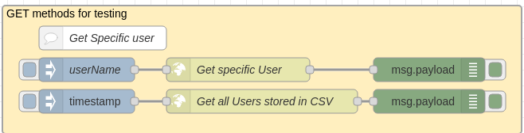
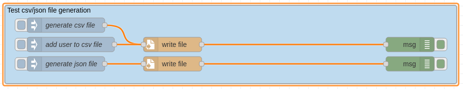
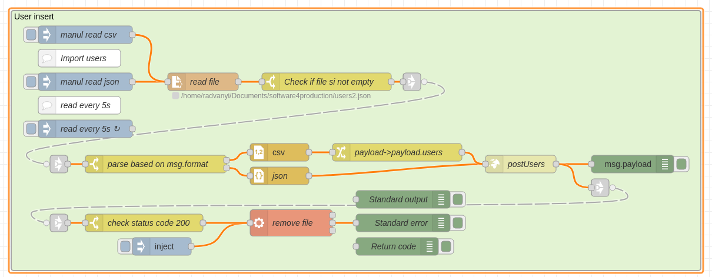

# NodeJS <--> Node-RED

**Required software**:
- NodeJS - tested on (v14.20.0)
- NPM - tested on (v9.4.1)
- Node-RED - tested on (v2.2.2)

- Extra software Postman for the API endpoint testing.

## NodeJS server

The servers source code is located in te *nodeJS-server* folder. \
The Node JS server is built by using the expressJS extension. 
The main objective of the REST API server is to provide three API endpoints.

### Server Parameters

- protocol: **HTTP**
- IP address: **127.0.0.1** or **localhost**
- port: **8081**

### Endpoints

- GET - **/getUsers** - The endpoint returns all users stored in the *nodeJS-server/users.csv* file.\
The stored users will be in the response body in the following content:

```json
{
  "users": [
    {
      "userName": "Radvanyi Matyas",
      "email": "  mradvanyi0122@gmail.com",
      "address": "  Rohovce 49 93030",
      "creationTimestamp": "  7574861c3ec89941"
    }
  ]
}
```

- GET - **/getUser?userName=<*userName*>** - The endpoint will return information about the user specified in the Query parameter. 
In case the user is not stored in the CSV file it will return an empty JSON.\
Example response body:

```json
{
    "userName": "Radvanyi Matyas",
    "email": "  mradvanyi0122@gmail.com",
    "address": "  Rohovce 49 93030",
    "creationTimestamp": "  7574861c3ec89941"
}
```

- POST - **/postUsers** \
The /postUsers endpoints purpose is to enable insert of users ot a CSV file which the server controls.
The usersData is passed in the requests body.
Example input data:
```json
{
  "users":
  [
    {
      "userName":"Radvanyi Matyas",
      "email":"mradvanyi0122@gmail.com",
      "address": "Rohovce 49 93030",
      "creationTimestamp": "7574861c3ec89941"
    },
    {
      "userName":"Radvanyi Tamas",
      "email":"tradvanyi@gmail.com",
      "address": "Rohovce 44 93030",
      "creationTimestamp": "7574861c3ec89941"
    }
  ]
}
```


### Installation
Clone the repository: \
``` git clone git@github.com:Mradvanyi123/NodeJS-Node-RED.git ``` \
Install packages: ``npm install```
Start server: ```npm start```

----
## Node-RED

The Node-RED flow is located in te *node-red* folder. \
Import the flow to your local Node-RED environment.

- Tests for the API servers HTTP GET methods. In case of the *Get specific User* you need to specify 
the *userName* you search for in the *userName* inject node.


 
- Helper sub flows to create test csv and json files.



- User insert from csv/json file to API server. The flow start with 3 inject nodes. All of them need to be modified in order to use. 
The inject nodes need to pass 2 parameters to the next node. 
  - msg.format: string __csv__ or __json__
  - msg.filename: the full path and the file name. */home/<folderName>/<folderName>/users.csv* 

After the data was sent to the API server and the response came back with HTTP status code 200 the file is deleted from the file system.

